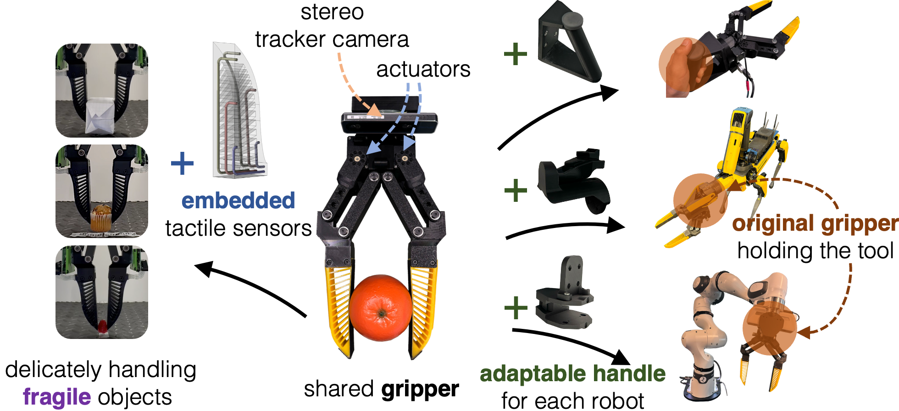
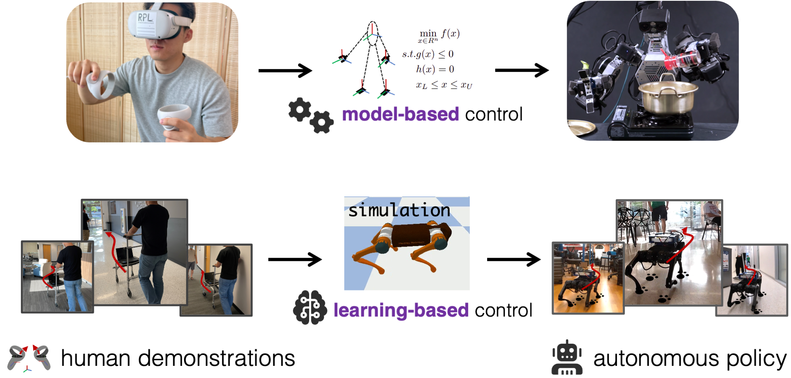
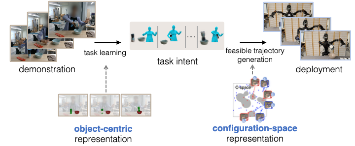
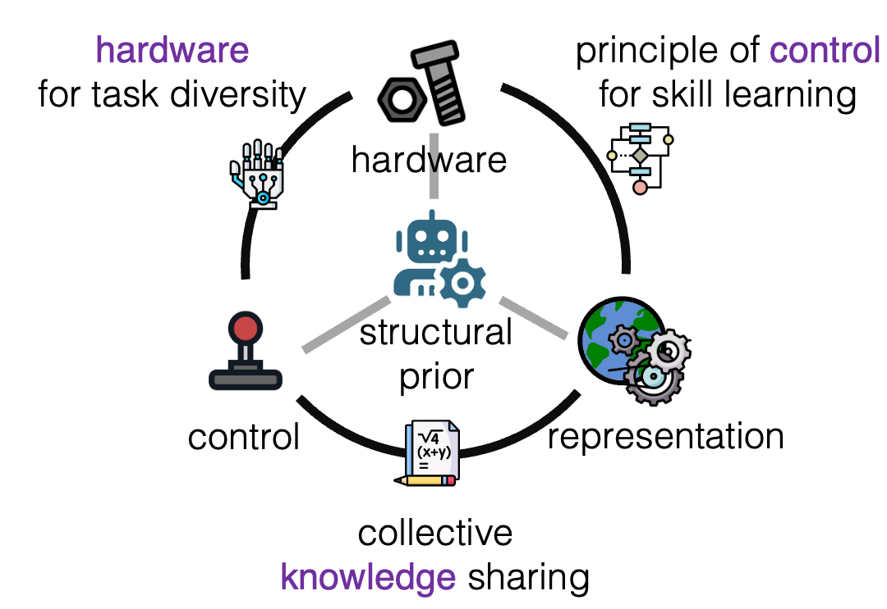

--
layout: common
permalink: /
categories: projects
--

<link media="all" href="./css/glab.css" type="text/css" rel="StyleSheet">

<link rel="preconnect" href="https://fonts.googleapis.com">
<link rel="preconnect" href="https://fonts.gstatic.com" crossorigin>
<link href="https://fonts.googleapis.com/css2?family=Didact+Gothic&family=Open+Sans:ital,wght@0,300..800;1,300..800&display=swap" rel="stylesheet">
<link href="https://fonts.googleapis.com/css2?family=Open+Sans:ital,wght@0,300..800;1,300..800&display=swap" rel="stylesheet">
<link rel="stylesheet" href="https://cdn.jsdelivr.net/gh/jpswalsh/academicons@1/css/academicons.min.css">

<head>
<title>Embodiment-Aware Skill Learning for Diverse Robots</title>

<meta http-equiv="Content-Type" content="text/html; charset=UTF-8">
<meta property="og:title" content="Embodiment-Aware Skill Learning for Diverse Robots">
<meta property="og:description" content="Mingyo Seo, Embodiment-Aware Skill Learning for Diverse Robots, Ph.D. Dissertation, The University of Texas at Austin, 2026.">
<meta property="og:url" content="https://kiwi-sherbet.github.io/Dissertation">

<!-- Google tag (gtag.js) -->
<!-- 
 -->

<!-- STLviewer tag -->
<!--  -->

</head>

<body data-gr-c-s-loaded="true">

<table align=center width=800px>
  <tr>
    <td>

  <h1>
    <strong>Embodiment-Aware Skill Learning for Diverse Robots</strong>
  </h1>
  <h3> <a href="https://mingyoseo.com"><b>Mingyo Seo</b></a></h3>
  <h3>Ph.D. Dissertation, The University of Texas at Austin</h3>

  

  <a href="#defense" style="color:#484824;">
    Defense
  </a>
  &nbsp;&nbsp;&nbsp;&nbsp;
  <a href="#abstract" style="color:#484824;">
    Abstract
  </a>
  &nbsp;&nbsp;&nbsp;&nbsp;
  <a href="#part1" style="color:#484824;">
    Part I
  </a>
  &nbsp;&nbsp;&nbsp;&nbsp;
  <a href="#part2" style="color:#484824;">
    Part II
  </a>
  &nbsp;&nbsp;&nbsp;&nbsp;
  <a href="#part3" style="color:#484824;">
    Part III
  </a>
  &nbsp;&nbsp;&nbsp;&nbsp;
  <a href="#futurework" style="color:#484824;">
    Future Work
  </a>

    </td>
  </tr>
</table>

<table align=center width=800px>
  <tr>
    <td>
      <h2 id="defense" align=center>Defense Recording</h2>
    </td>
  </tr>
  <tr>
    <td align=center valign=middle>
      <video muted controls autoplay loop width="598">
        <source src="./src/video/defense.mov"  type="video/mov">
      </video>
    </td>
  </tr>
</table>

<table align=center width=800px>
  <tr>
    <td>
      <h2 id="abstract" align=center>Abstract</h2>
    </td>
  </tr>
  <tr>
    <td>
      

      Robotic systems are rapidly diversifying in both form and application, spanning humanoids, mobile manipulators, and industrial platforms. Achieving generalist robot autonomy therefore requires skills that can be shared across robots while accounting for embodiment-specific constraints. Recent efforts have pursued this goal by scaling data across multiple platforms, learning structural differences and invariances from large datasets. However, robots, as engineered systems, exhibit behavior shaped by design choices in hardware, control, and representation. Rather than relying on learning algorithms to infer this structure from data alone, we develop embodiment-aware skill learning, which explicitly incorporates these system-level factors as structural priors to guide learning toward physically feasible and transferable behaviors.  
      This dissertation presents a holistic approach that combines hardware interfaces, control abstractions, and embodiment-aware representations. It begins with hardware design that enables consistent physical interaction and sensing across diverse robots. It then introduces control abstractions that structure learning within compact state-action spaces for high-degree-of-freedom systems. Finally, it develops representations that separate shared, object-centric task intent from embodiment-specific geometric constraints, enabling efficient skill transfer while maintaining feasibility and performance across different robot morphologies.  
      Our findings show that incorporating structural priors complements and strengthens skill learning, enabling robots to accumulate and transfer skills across embodiments while maintaining physical feasibility. This accelerates progress toward generalist robot autonomy, supporting scalable skill acquisition and reliable performance across a broad spectrum of rapidly evolving robot platforms.
      

    </td>
  </tr>
</table>

<table align=center width=800px>
  <tr>
    <td>
      <h2 id="part1" align=center>Part I: Designing Robot Hardware for Consistent Physical Interaction</h2>
    </td>
  </tr>
  <tr>
    <td align=center valign=middle>
      
    </td>
  </tr> 
  <tr>
    <td>
      

        A core challenge in robot autonomy is that each platform operates within its own domain, making skills hardware-specific and difficult to transfer. While most hardware components are fixed, interaction with the environment occurs primarily through end-effectors, making them a natural locus for co-design with sensorimotor abstractions. In Part I, we develop a series of end-effector grippers [<a href="https://ut-hcrl.github.io/LEGATO"><i class="fa-solid fa-link"></i>LEGATO</a>, <a href="https://merge-lab.github.io/FORTE"><i class="fa-solid fa-link"></i>FORTE</a>] that unify how robots grasp, sense, and manipulate objects. These grippers standardize visual and tactile perception as well as contact interactions across morphologies, allowing abstraction layers to interpret tactile and force feedback consistently. Serving as a shared interface for skill learning, they establish a unified action-observation space that supports cross-embodiment transfer, skill reuse, and scalable data collection. These works illustrate that hardware is not merely a constraint but an active component of robot learning.
      

    </td>
  </tr>
</table>

<table align=center width=800px>
  <tr>
    <td>
      <h2 id="part2">Part II: Bridging Control Architectures and Skill Learning</h2>
    </td>
  </tr>
  <tr>
    <td align=center valign=middle>
      
    </td>
  </tr> 
  <tr>
    <td>
      

        High-degree-of-freedom robots such as humanoids and legged systems offer rich capabilities but are difficult to control due to high-dimensional state-action spaces and complex dynamics. These challenges make skill learning inefficient, as even simple tasks can require large datasets. Introducing abstractions through intermediate controllers can reduce this complexity while preserving expressive robot motion and control. In Part II, we develop hybrid learning frameworks [<a href="https://ut-austin-rpl.github.io/TRILL"><i class="fa-solid fa-link"></i>TRILL</a>, <a href="https://ut-austin-rpl.github.io/PRELUDE"><i class="fa-solid fa-link"></i>PRELUDE</a>] that manage complex whole-body dynamics within lower-dimensional action spaces by optimizing control outputs under dynamic constraints. These control-driven abstractions simplify demonstrations, improve data efficiency, and enable scalable skill learning on robot systems whose dynamics would otherwise be difficult to learn directly. These works demonstrate how combining model-based and learning-based control architectures enables scalable skill learning by allowing each component to be developed in the domain where it is most effective.
      

    </td>
  </tr>
</table>

<table align=center width=800px>
  <tr>
    <td>
      <h2 id="part3" align=center>Part III: Learning Embodiment-Aware Representations for Skill Transfer</h2>
    </td>
  </tr>
  <tr>
    <td align=center valign=middle>
      
    </td>
  </tr>   
  <tr>
    <td>
      

        Achieving scalable robot autonomy requires skills that transfer across diverse robot embodiments while adapting to each platform’s physical constraints. While shared hardware interfaces and control abstractions enable transferable interactions, successful deployment still requires adapting learned behaviors to differences in morphology and kinematics. In Part III, we develop embodiment-aware representations that capture both task intent and embodiment-specific feasibility, enabling skills learned from demonstrations to transfer across robots. 
        Object-centric representations can extract task intent from demonstrations by capturing what should be accomplished in the scene, independent of the robot embodiment [<a href="https://ut-austin-rpl.github.io/OKAMI"><i class="fa-solid fa-link"></i>OKAMI</a>]. However, executing this intent on a new robot requires accounting for embodiment-specific feasibility, including morphology, kinematics, self-collision constraints, and joint limits. To address this, Chapter~\ref{ch:07_presto} develops C-space-based embodiment-aware representations that support feasible trajectory generation on the target robot [<a href="https://kiwi-sherbet.github.io/PRESTO"><i class="fa-solid fa-link"></i>PRESTO</a>]. These works demonstrate how embodiment-aware representations enable flexible skill transfer across robots by separating task intent from embodiment-specific motion generation while fully leveraging each robot’s capabilities.
      

    </td>
  </tr>
</table>

<table align=center width=800px>
  <tr>
    <td>
      <h2 id="futurework" align=center>Future Work</h2>
    </td>
  </tr>
  <tr>
    <td align=center valign=middle>
      
    </td>
  </tr>
  <tr>
    <td>
      

        Looking ahead, achieving generalist robot autonomy requires robots to accumulate knowledge across different embodiments, transfer that knowledge to new systems, and compose it into behaviors that generalize across tasks and platforms. A central question is how skills can be reused and composed when both task structure and robot embodiment vary. Rather than treating skill composition as purely an algorithmic problem, it should be viewed as fundamentally constrained by embodiment. The structure of the robot, its sensing and actuation capabilities, and the abstractions used to represent actions shape which behaviors can be learned, transferred, and composed. To move toward this goal, future research will study richer forms of skill composition by building on and extending the structural priors explored in this dissertation. In particular, it will investigate how control abstractions, hardware design, and representations jointly determine which skill compositions are feasible and reusable across robots. Grounded in the integration of robot-specific structural priors for developing generalizable skills, this research aims to advance the next generation of generalist robot autonomy.
      

    </td>
  </tr>
</table>

<h2 align="center">Contact</h2>
<table align=center width=800px>
  <tr>
    <td> 
      

        For questions, please contact <a href="https://mingyoseo.com/">Mingyo Seo</a>.
      

    </td>
  </tr>
</table>

</body>